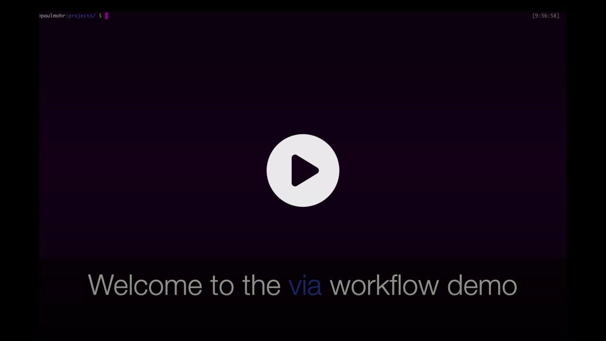

<div align="center">
  

  Manage your local dev environments with ease
</div>
<hr>
<br /><br />

## Installation
### OSX (arm, brew)
```bash
brew tap sopamo/via https://github.com/sopamo/via
brew install sopamo/via/via
# Create an alias if you want to access via with v
echo "alias v=via" >> ~/.bash_aliases
source ~/.bash_aliases
```

### Linux (x86_64, snap)
```bash
# Coming soon, waiting for approval
snap install via-cli --classic
# Create an alias if you want to access via with v
echo "alias v=via-cli" >> ~/.bash_aliases
source ~/.bash_aliases
```

### ArchLinux (x86_64, AUR)
```bash
yay via-cli-bin
# Create an alias if you want to access via with v
echo "alias v=via" >> ~/.bash_aliases
source ~/.bash_aliases
```

<div align="center">

[](https://youtu.be/lD-CBiXZfP4)
[Watch the via demo video](https://youtu.be/lD-CBiXZfP4)
</div>
<br />

## Project setup
Create your first project configuration file by running `v init my-project` and follow the instructions.

You can then run `v my-project start` to start your project. Of course, you can rename the my-project.yaml file to match your project's name.

## Project configuration

### Minimal configuration
```yaml
services:
  app:
    path: /Users/username/project/app
    actions:
      start: docker-compose up -d
      stop: docker-compose down
```
You always have to specify the start and stop actions.

When running the `replace` action, all other projects will be stopped automatically.

### Adding custom actions
```yaml
services:
  app:
    actions:
      bash: docker-compose exec app bash
```
You can run individual actions like this:

```bash
v my-project app bash
```

### Adding more advanced actions
You can always use the feature set of the `sh` shell. Like operators, conditions and variables. So you can build powerful workflows which saves you brain capacity and time.
```yaml
services:
  app:
    actions:
      # Shell Operators
      #
      # use yaml multiline strings and shell operators to run multiple
      # commands after the other.
      start: >
        docker-compose up -d &&
        echo "startup done" &&
        docker-compose exec app npm run watch &&
        code .

      # Shell Variables
      #
      # $@ is a shell variable which holds all passed arguments
      # so it is possible to pass all arguments to a command by running:
      # v my-project app exec npm install double-vue
      exec: docker-compose exec app $@
      # You can pass individual shell arguments as well by using $1..$[x]
      create-branch: git checkout -b feature/$1

      # Custom Shell
      #
      # If running your commands in a simple `sh` is not enough you could
      # launch your favorite shell as well to leverage more complex tasks
      watch: zsh -c "source ~/.zshrc && nvm use && npm run watch"

```

## Terminology

| Term | Description | Example |
| ---- | ----------- | ------- |
| Project | Combines logically and technical related services | TodoList |
| Service | Individual folders/repos/services which are necessary to work on the project | `frontend`, `backend`, `database` |
| Action | Is the name which refers to the underlying command | `start: <cmd>` |
| Command | The command which gets executed by via | `docker-compose up -d` |
| Argument | All arguments passed after a via action. | `v my-project app exec x y -z` `x`,`y1`, `-z` are the Arguments |

<br />
<br />
<br />

## Via development setup
First, follow the project setup instructions.
Then, to run the project locally, install [deno](https://deno.land).

To run the code directly, run:
```bash
deno run --allow-read --allow-run --allow-env --allow-write ./src/via.ts [project] [service] [action]
```

To build the binary, run:
```bash
deno compile --allow-read --allow-run --allow-env --allow-write ./src/via.ts
```
